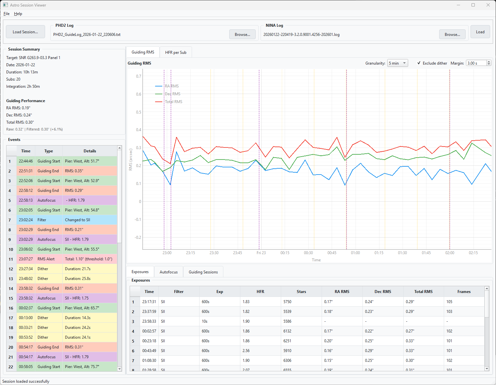
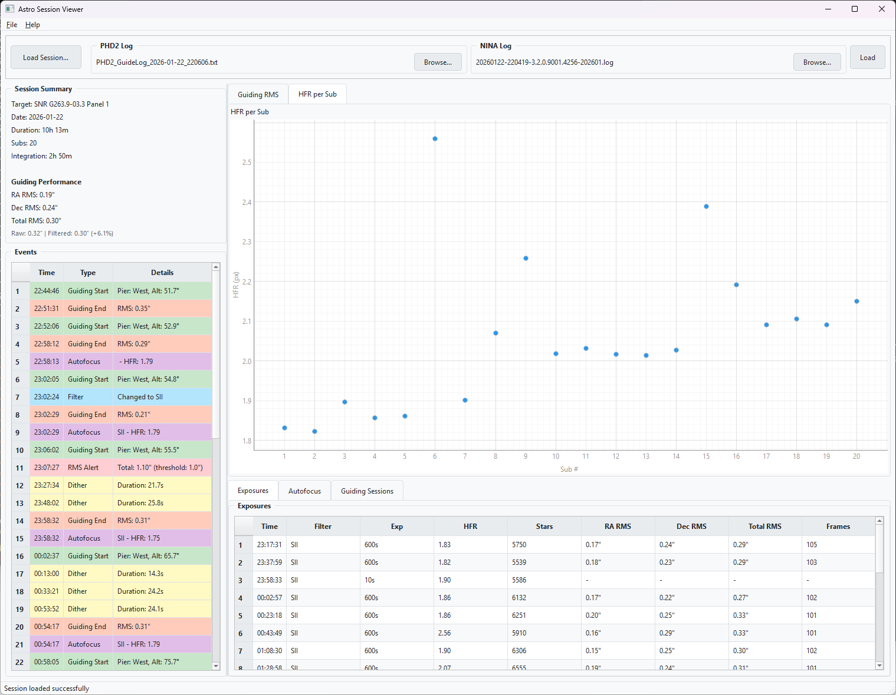
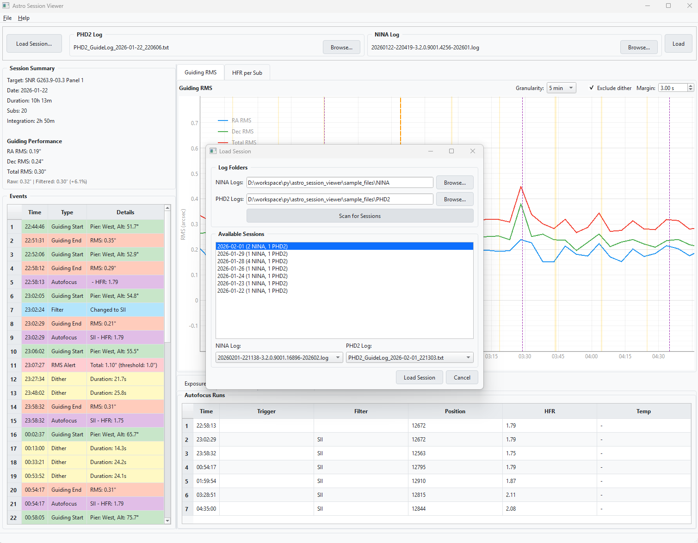

# Astro Session Viewer

A PyQt6 desktop application for analyzing astrophotography imaging sessions using NINA and PHD2 log files.


## Features

### Log Parsing
- **PHD2 Guide Logs** - Parses guiding frames, RMS calculations, pier side, equipment info
- **NINA Logs** - Parses exposures, autofocus runs, filter changes, dither events, meridian flips
- **Auto-matching** - Automatically matches NINA and PHD2 logs by date

### Guiding Analysis
- **RMS Timeline Chart** - RA/Dec/Total RMS over time with configurable granularity
- **Per-Exposure RMS** - Guiding quality correlated with each sub
- **Dither Exclusion** - Configurable margin to exclude dither settling from RMS calculations
- **Event Markers** - Visual markers for autofocus, meridian flips, and dither events

### Image Quality Metrics
- **HFR per Sub** - Chart showing HFR values color-coded by filter
- **Autofocus Tracking** - Table of all AF runs with trigger, position, HFR, and temperature
- **Quality Indicators** - Color-coded warnings for poor guiding or high HFR

### Session Management
- **Session Finder** - Scan folders to discover and load sessions by date
- **Multi-log Support** - Handle multiple NINA logs per session

## Installation

```bash
# Clone the repository
git clone https://github.com/YOUR_USERNAME/astro-session-viewer.git
cd astro-session-viewer

# Install dependencies
pip install -r requirements.txt

# Run the application
python main.py
```

## Requirements

- Python 3.10+
- PyQt6 >= 6.6.0
- pyqtgraph >= 0.13.3
- numpy >= 1.24.0
- pandas >= 2.0.0

## Usage

### Quick Start
1. Click **"Load Session..."** or press `Ctrl+O`
2. Browse to your NINA and PHD2 log folders
3. Click **"Scan for Sessions"**
4. Select a session from the list and click **"Load Session"**

### Manual Loading
1. Use **"Browse..."** buttons to select individual log files
2. Click **"Load"** to parse and display the data

### Dither Settings
- **Exclude dither** checkbox - Toggle dither exclusion from RMS calculations
- **Margin** spinbox - Set seconds before/after dither to exclude (default: 3s)

## Screenshots

### Main Window - Guiding RMS Chart

*Session summary, guiding RMS timeline with dither markers (yellow), autofocus markers (purple), and meridian flip markers (orange). Exposures table shows per-sub guiding RMS.*

### HFR Per Sub Chart

*HFR values for each sub, color-coded by filter.*

### Session Loader

*Scan NINA and PHD2 log folders to discover and load sessions by date.*

## Log File Locations

### NINA Logs (Windows)
```
C:\Users\<username>\AppData\Local\NINA\Logs\
```

### PHD2 Logs (Windows)
```
C:\Users\<username>\Documents\PHD2\
```

## License

MIT License - See LICENSE file for details.

## Acknowledgments

- [NINA](https://nighttime-imaging.eu/) - Nighttime Imaging 'N' Astronomy
- [PHD2](https://openphdguiding.org/) - Open PHD Guiding
